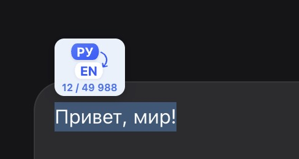

<div align="center">
  
</div>

# Inpulator

Переводите мысль **прямо в поле ввода** — в чате, почте или форме. Без вкладки переводчика, без копипаста.

Выделили текст → нажали кнопку или горячую клавишу → на месте уже перевод на выбранный язык.

## Зачем

Пишете на одном языке, а думаете на другом? Обычный путь: набрать → открыть переводчик → скопировать → вставить. Inpulator сокращает это до двух действий: **выделить и перевести**.

## Возможности

- **Перевод на месте** — выделение заменяется переводом в том же поле
- **Несколько языков** — английский, русский, испанский, французский, немецкий, китайский; целевой язык выбирается в настройках
- **Автоопределение источника** — язык выделения определяется автоматически
- **Плавающая кнопка** — рядом с выделением; на иконке коды пары (например `ES→EN`)
- **Горячая клавиша** — `Alt+Shift+T` (на macOS: `Option+Shift+T`)
- **Три провайдера** — MyMemory по умолчанию, Chrome Translator (on-device), Google Translate
- **Индикатор лимита** — кольцо использования вокруг кнопки; точные цифры в тултипе
- **Настройки** — провайдер, целевой язык, исключения языков и сайтов, Google API key, вкл/выкл
- **Широкая поддержка полей** — `<input>`, `<textarea>`, `contenteditable` (Gmail, ChatGPT, Slack и др.), включая Shadow DOM
- **Понятные состояния** — спиннер при загрузке, toast при ошибке

## Как пользоваться

1. В настройках выберите язык **«Переводить на»** (по умолчанию English)
2. Введите текст в любое поддерживаемое поле
3. Выделите фрагмент для перевода
4. Нажмите кнопку перевода **или** горячую клавишу
5. Выделение заменится переводом

Кнопка появляется, если язык выделения отличается от целевого и не исключён в настройках. Исчезает, когда выделение снято.

Откройте настройки по иконке расширения: целевой язык, исключения языков/сайтов, провайдер, пакеты Chrome или Google API key.

## Горячая клавиша

| Платформа       | Комбинация       |
| --------------- | ---------------- |
| Windows / Linux | `Alt+Shift+T`    |
| macOS           | `Option+Shift+T` |

Переназначить: `chrome://extensions/shortcuts`

## Языки

| Код | Язык     |
| --- | -------- |
| en  | English  |
| ru  | Русский  |
| es  | Español  |
| fr  | Français |
| de  | Deutsch  |
| zh  | 中文     |

- **Целевой язык** — селект в настройках
- **Не переводить с** — исключённые источники; можно исключить язык текущего выделения или выбрать из списка
- **Сайт** — переключатель «Включить на этом сайте» добавляет/убирает домен из блок-листа

## Провайдеры и лимиты

| Провайдер         | Лимит (локальный)   | Примечание                                               |
| ----------------- | ------------------- | -------------------------------------------------------- |
| MyMemory          | **50 000 / день**   | По умолчанию; облачный сервис, текст уходит на MyMemory  |
| Chrome Translator | **Без лимита**      | On-device, Chrome 138+ desktop                           |
| Google Translate  | **500 000 / месяц** | Нужен личный API key в настройках; текст уходит в Google |

Всегда используется **только выбранный** провайдер — без автоматического переключения. Если он недоступен или лимит исчерпан, выберите другой в настройках.

Счётчики Google/MyMemory хранятся локально и являются **оценкой**, а не точным биллингом API.

Для Chrome Translator пакеты качаются **для нужной пары языков** (по выделению и целевому языку) — в настройках или автоматически при первом переводе. Управление пакетами в браузере: `chrome://on-device-translation-internals`.

## Ограничения

- Chrome Translator: **Chrome 138+ desktop** (не mobile)
- Кнопка не появляется, если источник = целевой язык или источник в исключениях
- Не работает в **cross-origin iframe**
- В rich text вставляется plain text — форматирование теряется
- После обновления расширения **перезагрузите вкладку** (F5)

## Установка

### Из исходников

1. Скачайте или клонируйте репозиторий
2. Откройте `chrome://extensions`
3. Включите **Режим разработчика**
4. **Загрузить распакованное расширение** → выберите папку проекта
5. (Опционально) Для Google Translate создайте личный ключ [Cloud Translation API](https://cloud.google.com/translate/docs/basic/translating-text), ограничьте его Translation API и квотой, затем добавьте в настройки

### Обновление

1. Скачайте последнюю версию репозитория
2. Замените текущую папку проекта новой
3. `chrome://extensions` → обновить расширение
4. Перезагрузите открытые вкладки

## Проверки кода

```bash
npm install
npm test
npm run lint
npm run format:check
```

## Приватность

- **Chrome Translator** — перевод on-device, текст не уходит на внешний сервер
- **Google / MyMemory** — текст отправляется только если вы сами выбрали этот провайдер
- Локально хранятся: настройки, счётчики usage и личный Google API key (`chrome.storage.local`)
- Не передавайте API key другим людям; ограничьте его Cloud Translation API и квотами

## Документация для разработчиков

Техническая документация, архитектура, структура файлов: [DOCUMENTATION.md](DOCUMENTATION.md)

## Стек

JavaScript (vanilla) · Manifest V3 · Chrome Translator API · Google Cloud Translation · MyMemory
